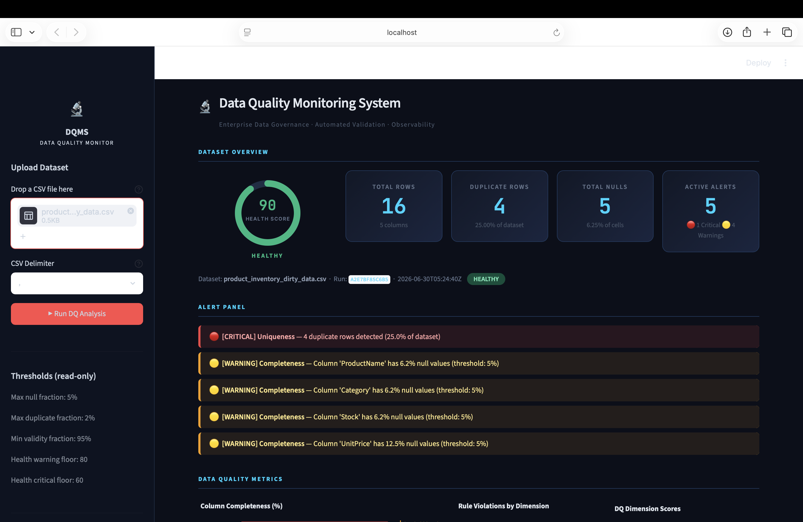
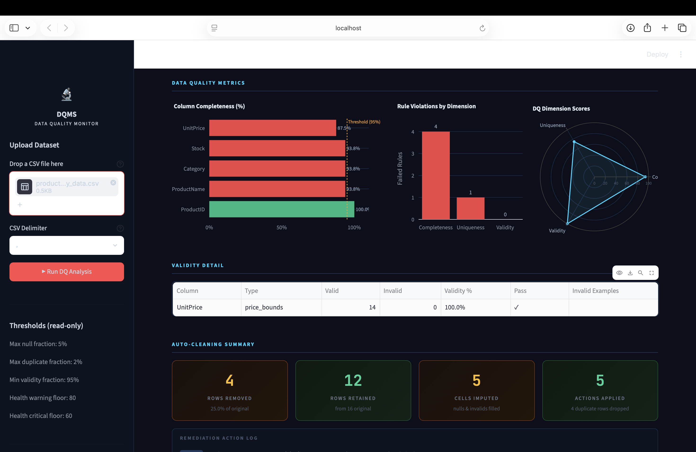
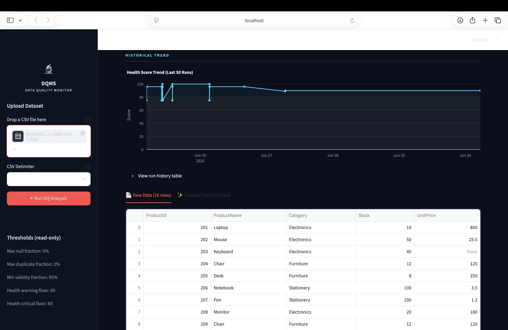
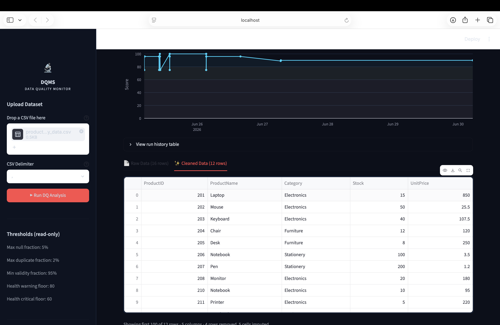

# 🔬 Data Quality Monitoring System (DQMS)

> **Enterprise-grade data quality monitoring, automated validation, and intelligent auto-cleaning — built with Streamlit and Pandas.**

[](https://python.org)
[](https://streamlit.io)
[](https://pandas.pydata.org)
[](https://plotly.com)
[](LICENSE)

---

## 📌 Overview

The **Data Quality Monitoring System (DQMS)** is a production-ready web application that allows data teams to upload any CSV dataset and instantly receive a comprehensive quality assessment across three core dimensions — **Completeness**, **Uniqueness**, and **Validity**.

It detects issues, generates actionable alerts, visualises metrics through interactive charts, and automatically produces a cleaned version of the dataset — all in a single click.

---

## 🖥️ Screenshots

### Dashboard Overview — Health Score & Alert Panel


### Data Quality Metrics — Completeness, Rule Violations & Radar Chart


### Historical Trend & Raw Data Table


### Cleaned Data Output After Auto-Cleaning


---

## ✨ Features

| Feature | Description |
|---|---|
| 📤 **CSV Upload** | Drag-and-drop any CSV file with configurable delimiter |
| 💯 **Health Score** | Single 0–100 score summarising overall dataset quality |
| 🔍 **Completeness Check** | Detects null/missing values per column vs configurable threshold |
| 🔁 **Uniqueness Check** | Detects and counts duplicate rows across the full dataset |
| ✅ **Validity Check** | Rule-based validation (e.g. price bounds, format constraints) |
| 🚨 **Alert Panel** | Ranked CRITICAL and WARNING alerts with exact column-level detail |
| 📊 **Visualisations** | Completeness bar chart, rule violation chart, DQ dimension radar chart |
| 🧹 **Auto-Cleaning** | Removes duplicate rows, imputes missing values, exports cleaned CSV |
| 📈 **Historical Trend** | Tracks health score across all past runs in a time-series chart |
| 🗂️ **Raw vs Cleaned View** | Side-by-side tab comparison of before/after datasets |

---

## 🏗️ Architecture

```
User (Browser)
      │
      ▼  Upload CSV
Streamlit App (app.py)
      │
      ├── Sidebar: Upload · Delimiter · Thresholds · Run button
      │
      ▼  Run DQ Analysis
Data Quality Engine (dq_engine.py)
      ├── 1. CSV Parsing          → pandas.read_csv()
      ├── 2. Completeness Check   → null detection per column
      ├── 3. Uniqueness Check     → duplicate row detection
      ├── 4. Validity Check       → rule-based validation
      ├── 5. Health Score         → weighted scoring formula
      └── 6. Alert Generation     → CRITICAL / WARNING classification
      │
      ├── Visualisations (Plotly)
      │     ├── Column Completeness bar chart
      │     ├── Rule Violations by Dimension bar chart
      │     └── DQ Dimension Scores radar chart
      │
      ├── Auto-Cleaning Engine
      │     ├── Drop duplicate rows
      │     └── Impute missing values (mean/mode)
      │
      └── Run History Store (SQLite / JSON)
            └── Health score trend over time
```

---

## 📊 DQ Dimensions Explained

### Completeness
Measures the percentage of non-null values per column.
```
completeness_pct = (non_null_count / total_rows) × 100
```
Threshold: **5% max null fraction** — columns exceeding this trigger a `[WARNING]`.

### Uniqueness
Measures duplicate rows across the full dataset.
```
duplicate_fraction = duplicate_rows / total_rows × 100
```
Threshold: **2% max duplicate fraction** — exceeding this triggers a `[CRITICAL]`.

### Validity
Rule-based format/range checks on specific columns.
```
validity_pct = (valid_values / total_values) × 100
```
Threshold: **95% min validity fraction** — columns below this trigger a `[WARNING]`.

### Health Score (Overall)
Weighted combination of all three dimensions:
```python
health_score = (
    w1 × completeness_avg_pct +
    w2 × (100 - duplicate_fraction) +
    w3 × validity_avg_pct
)
```

| Score Range | Status | Meaning |
|---|---|---|
| 80 – 100 | 🟢 HEALTHY | Dataset meets all quality thresholds |
| 60 – 79 | 🟡 WARNING | Some quality issues require attention |
| 0 – 59 | 🔴 CRITICAL | Significant data quality problems |

---

## 🧪 Sample Run Results

Using the included **`product_inventory_dirty_data.csv`** sample:

| Metric | Value |
|---|---|
| Total Rows | 16 |
| Health Score | **90 / 100 — HEALTHY** |
| Duplicate Rows | 4 (25.0% of dataset) |
| Total Nulls | 5 (6.25% of cells) |
| Active Alerts | 5 (1 Critical · 4 Warnings) |
| Rows After Cleaning | 12 |
| Cells Imputed | 5 |

### Alerts Generated
```
🔴 [CRITICAL] Uniqueness       — 4 duplicate rows detected (25.0% of dataset)
🟡 [WARNING]  Completeness     — Column 'ProductName' has 6.2% null values (threshold: 5%)
🟡 [WARNING]  Completeness     — Column 'Category' has 6.2% null values (threshold: 5%)
🟡 [WARNING]  Completeness     — Column 'Stock' has 6.2% null values (threshold: 5%)
🟡 [WARNING]  Completeness     — Column 'UnitPrice' has 12.5% null values (threshold: 5%)
```

---

## 🚀 Quick Start

### Prerequisites
- Python 3.9+
- pip

### Installation

```bash
# 1. Clone the repository
git clone https://github.com/rajaka43/-data-quality-monitoring-system.git
cd -data-quality-monitoring-system

# 2. Create virtual environment
python3 -m venv venv
source venv/bin/activate        # Windows: venv\Scripts\activate

# 3. Install dependencies
pip install -r requirements.txt

# 4. Run the app
streamlit run app.py
```

App opens at **http://localhost:8501** 🎉

---

## 📁 Project Structure

```
data-quality-monitoring-system/
├── app.py                          ← Streamlit UI — main entry point
├── dq_engine.py                    ← Data quality validation engine
├── config.py                       ← Threshold configuration
├── requirements.txt                ← Python dependencies
├── data/
│   └── product_inventory_dirty_data.csv   ← Sample dirty dataset
├── docs/
│   └── screenshots/                ← Dashboard screenshots
│       ├── dashboard-overview.png
│       ├── dq-metrics-charts.png
│       ├── raw-data-trend.png
│       └── cleaned-data.png
└── README.md
```

---

## ⚙️ Configuration Thresholds

Thresholds are shown read-only in the sidebar and can be modified in `config.py`:

```python
# config.py
MAX_NULL_FRACTION       = 0.05   # 5%  — max allowed null fraction per column
MAX_DUPLICATE_FRACTION  = 0.02   # 2%  — max allowed duplicate fraction
MIN_VALIDITY_FRACTION   = 0.95   # 95% — min required validity fraction
HEALTH_WARNING_FLOOR    = 80     # below this → WARNING status
HEALTH_CRITICAL_FLOOR   = 60     # below this → CRITICAL status
```

---

## 🗄️ Sample Dataset

The included `product_inventory_dirty_data.csv` contains deliberately dirty data to exercise every check:

| ProductID | ProductName | Category | Stock | UnitPrice |
|---|---|---|---|---|
| 201 | Laptop | Electronics | 15 | 850 |
| 202 | Mouse | Electronics | 50 | 25.5 |
| 203 | Keyboard | Electronics | 40 | **None** ← missing |
| 204 | Chair | Furniture | 12 | 120 |
| 205 | Desk | Furniture | 8 | 250 |
| 209 | Chair | Furniture | 12 | 120 | ← **duplicate of row 204** |
| ... | ... | ... | ... | ... |

Intentional issues: 4 duplicate rows · 1 missing UnitPrice · 4 other null values across columns

---

## 🛠️ Tech Stack

| Technology | Version | Role |
|---|---|---|
| [Python](https://python.org) | 3.9+ | Core language |
| [Streamlit](https://streamlit.io) | 1.x | Web UI framework |
| [Pandas](https://pandas.pydata.org) | 2.x | Data processing |
| [Plotly](https://plotly.com/python) | 5.x | Interactive charts |

---

## 🔄 How It Works — Step by Step

1. **Upload** any CSV file via the sidebar drag-and-drop
2. **Configure** the CSV delimiter (default: comma)
3. **Click** `▶ Run DQ Analysis`
4. The engine runs **completeness → uniqueness → validity** checks
5. A **Health Score** (0–100) is calculated and displayed as a gauge
6. **Alerts** are ranked and displayed (CRITICAL first, then WARNINGS)
7. **Charts** render: column completeness bars, rule violations, radar chart
8. **Auto-cleaning** removes duplicates and imputes missing values
9. Switch between **Raw Data** and **Cleaned Data** tabs to compare
10. Every run is stored and the **Health Score Trend** chart updates

---

## 📄 Technical Documentation

Full technical documentation including architecture diagrams, metric calculations, and detailed feature explanations is available in:

📘 [`docs/technical_documentation.html`](docs/technical_documentation.html)

---

## 📜 License

This project is licensed under the **MIT License** — see [LICENSE](LICENSE) for details.

---

## 👤 Author

**Viraj** · [@rajaka43](https://github.com/rajaka43)

⭐ If you found this useful, please star the repository!

---

*Built as part of an enterprise data engineering internship project demonstrating real-world data quality monitoring practices.*